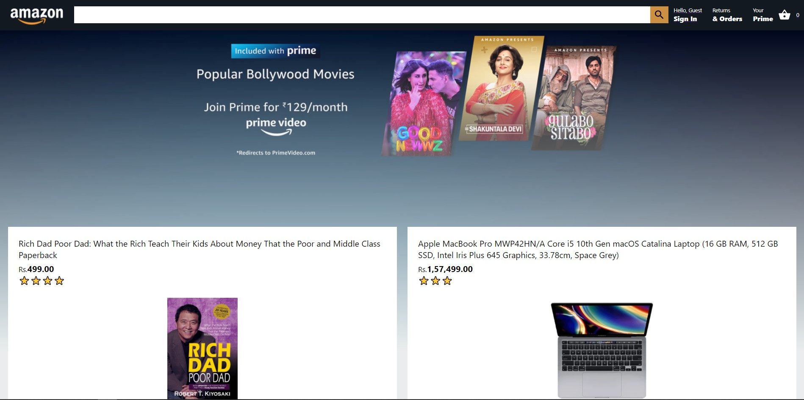
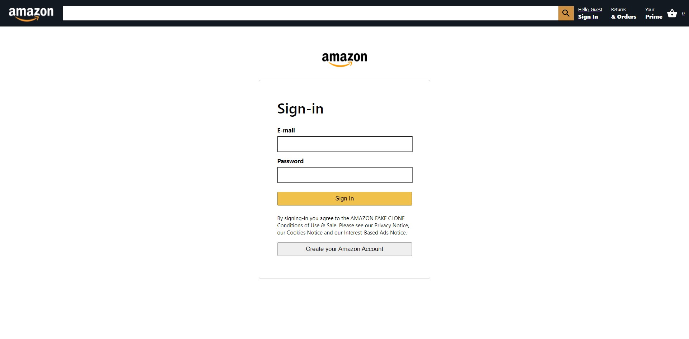

# Amazon Clone

This project is a clone of the Amazon website. Hosted on Firebase at https://clone-27ad8.web.app/

### Don't use it for any commercial purposes.

# Project Screenshots

# Home page

# Login Page

# Note For Developers

### Technologies Used:

1. React JS
2. Material UI for icons
3. Stripe for payment gateway
4. Firebase for backend and deployment

Icons from Material UI library have been used. Link is [https://material-ui.com/components/material-icons/](https://material-ui.com/components/material-icons/)

You can run the below commands to see the project on your local system.

# Steps to run this project on your local machine:

Disclaimer: Use the package manager you have on your system. Run either: npm or yarn.

### Step - 1

Download the zip file from the above "Code" option, \
 or, \
Clone this repository by running the command "git clone https://github.com/shivendradb/Amazon-clone-ReactJS.git" on the command prompt on your machine. \
Now, open the project directory using "cd Amazon-clone-ReactJS" command.

### Step - 2

In the project directory, run the command "npm install" on the command prompt to install the dependencies of the project on your local machine.

### Step - 3

Run the project on the localhost by running "npm start" on the command prompt.

Great!! 😃 You are done with the setup part. 🚀

Now, open [http://localhost:3000](http://localhost:3000) to view it in your browser.

The page will reload if you make edits.\
You will also see any lint errors in the console.
